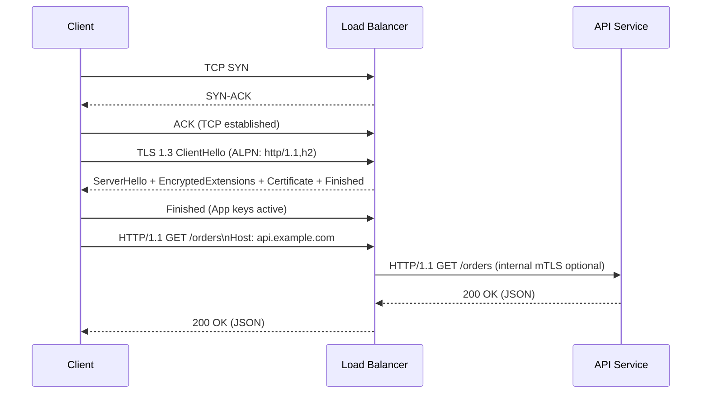

# HTTP/1.1: Architecture and Sequence Flows

HTTP/1.1 is ubiquitous and simple, ideal for compatibility and straightforward REST APIs. It uses TCP and typically runs over TLS (HTTPS).

## When to Use
- Public REST APIs with broad client compatibility.
- Simple services with moderate throughput.
- Environments where HTTP/2/3 is not yet available.

Avoid when:
- You need multiplexing or bi-directional streaming.
- You operate over lossy/mobile networks where HTTP/3 shines.

## Layering
- App: HTTP/1.1 (JSON, XML), compression (gzip/brotli), auth (OAuth2/JWT)
- Transport: TCP
- Security: TLS 1.2+ (prefer 1.3)
- Network: IPv4/IPv6

## Reference Architecture
- External: Client → CDN/Edge → WAF → Load Balancer → API Gateway → Services
- Internal: API Gateway → Services (HTTP/1.1 or HTTP/2), with mTLS inside the mesh

## Sequence: TCP + TLS 1.3 + HTTP/1.1

## Architecture Notes
- Use keep-alive and connection reuse; avoid HTTP pipelining (rarely supported).
- Prefer idempotent methods (GET/PUT) for safe retries; otherwise use idempotency keys.
- Terminate TLS at edge or gateway; use mTLS internally for zero-trust.
- Cache at CDN and gateway: leverage ETag/If-None-Match and Cache-Control.

## Reliability Patterns
- Retries with exponential backoff + jitter; honor Retry-After for 429/503.
- Timeouts: connect, TLS handshake, read; budget within SLOs.
- Circuit breakers and bulkheads to avoid cascading failures.
- Rate limiting and quotas at gateway.

## Performance Tips
- Enable gzip/brotli for text; avoid double-compressing media.
- Prefer JSON with stable schemas; consider CBOR for constrained clients.
- Reduce headers; leverage ETag and conditional requests.
- Consider upgrading to HTTP/2 for multiplexing or to HTTP/3 for lossy networks.

## Security
- Enforce TLS 1.3 and HSTS; disable weak ciphers.
- OAuth2/OIDC for user auth; short-lived JWTs with proper audience/issuer checks.
- Validate inputs and enforce payload size limits.
- Log and scrub sensitive data; protect telemetry channels.

## Testing and Tools
- curl, httpie, Postman/Newman.
- Load: k6, Locust, JMeter, Vegeta.
- Inspect: mitmproxy, Wireshark.