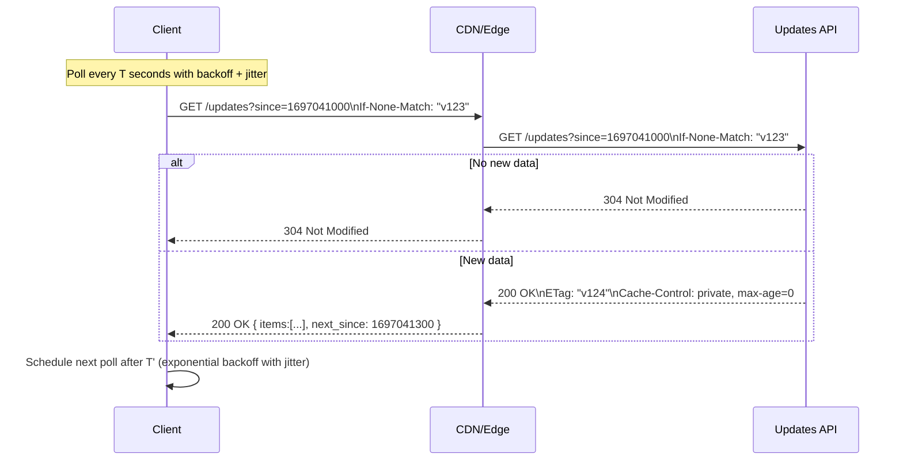

# HTTP Polling: Architecture and Sequence Flows

Polling is a client-driven pattern where the client repeatedly sends short-lived HTTP requests at a fixed or adaptive interval to check for updates.

## When to Use
- Simple clients or networks where long-lived connections are unreliable or blocked.
- Low update frequency and tolerant of seconds-level latency.
- Endpoints that are cacheable (ETag/Last-Modified) and inexpensive to fetch.

Avoid when:
- You need sub-second latency or high-frequency updates (consider long polling, SSE, or WebSocket).
- Many clients would hammer the backend with redundant requests.

## Layering
- Application: HTTP/1.1 or HTTP/2 GET; conditional requests (ETag/If-None-Match, If-Modified-Since)
- Transport: TCP (+TLS)
- Caching: CDN/gateway respects Cache-Control, ETag/Last-Modified

## Reference Flow

## Design Guidelines
- Use conditional requests:
  - ETag/If-None-Match or Last-Modified/If-Modified-Since to return 304 Not Modified.
  - Send minimal payloads and support pagination/cursors (e.g., since, after_id).
- Throttle and randomize:
  - Exponential backoff (e.g., 1s, 2s, 4s… capped) with jitter to avoid thundering herds.
  - Respect Retry-After on 429/503.
- Cache wisely:
  - Static or slow-changing resources can be cached at CDN with Cache-Control and ETag.
  - For user-specific data, use private caches or disable CDN caching.
- Idempotency and dedup:
  - Include a stable cursor (timestamp, seq, event_id) to avoid duplicates.
- Errors and timeouts:
  - Separate connect/read timeouts; surface partial failures and degrade gracefully.

## Pros and Cons
- Pros: Easiest to implement; resilient to proxies; works everywhere.
- Cons: Wastes cycles when no updates; added latency governed by poll interval; can overload backends at scale.

## Implementation Tips
- Clients: keep a stored ETag/Last-Modified and cursor; implement backoff/jitter and 304 handling.
- Servers: implement conditional GET; support lightweight list endpoints; return 206 Partial Content for ranges if needed.
- Ops: set API rate limits; monitor 304 ratio, request latency, and error codes.

## Testing and Tools
- curl/httpie to test ETag/If-None-Match and 304 behavior.
- CDN/gateway config to validate cache headers.