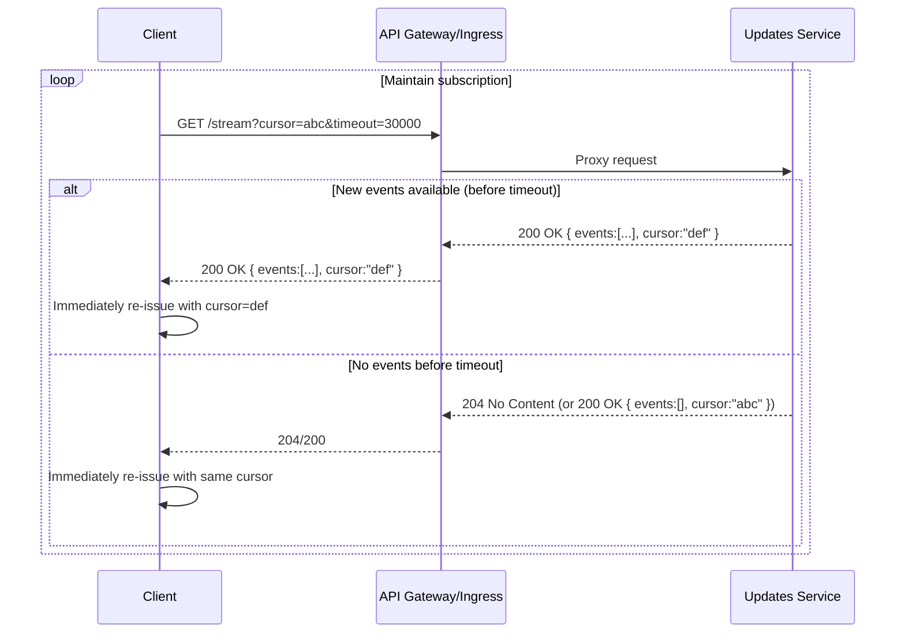

# HTTP Long Polling (Comet): Architecture and Sequence Flows

Long polling keeps an HTTP request open until data is available or a server-side timeout occurs, then responds immediately. The client reissues the request to maintain near real-time updates without a fully persistent bidirectional channel.

## When to Use
- Near real-time notifications where WebSocket/SSE are unavailable or blocked.
- Simpler operational model than WebSocket but lower latency than short polling.
- Mobile networks with frequent IP changes where reconnect behavior is acceptable.

Avoid when:
- Very high event rates or strict bidirectional needs (prefer WebSocket).
- Large fan-out broadcasting (consider SSE or a push gateway).

## Layering
- Application: HTTP/1.1 or HTTP/2 GET to a blocking endpoint with cursors
- Transport: TCP (+TLS)
- Server-side event source: DB notifications, message broker, in-memory queue

## Reference Flow

Alternative: respond with Retry-After to pace re-requests.

## Design Guidelines
- Cursoring:
  - Use a monotonic cursor (event_id, offset, timestamp) returned with each response.
  - Server must handle stale/missing cursors (return from oldest retained or 410 Gone if too old).
- Timeouts and heartbeats:
  - Server-side max hold (e.g., 25–55s) below proxy idle timeouts; include keepalive comments/whitespace if intermediaries require traffic.
  - Client read timeout slightly higher than server hold-time; reconnect immediately on 204/empty.
- Backpressure and limits:
  - Cap max events per response; paginate and continue via cursor.
  - If backlog too large, send 206 Partial Content or signal resync requirement.
- Error handling:
  - On 429/503, honor Retry-After; apply backoff with jitter.
  - Treat network errors as transient; re-establish from last acknowledged cursor.
- Idempotency and dedup:
  - Events must be idempotent or deduplicated by event_id/cursor on the client.

## Server Architecture
- Use event-driven servers (async IO) to avoid one-thread-per-connection.
- Source events from:
  - Message brokers (Kafka, RabbitMQ) with per-client cursor mapping.
  - DB notifications (LISTEN/NOTIFY) or change streams with buffering.
  - In-memory queues (with persistence for durability as needed).
- Scale considerations:
  - Maintain per-connection memory limits; avoid per-connection heavy state.
  - Distribute clients across instances; use sticky sessions only if necessary.
  - Horizontal scale with shared event storage or sharded topics.

## Edge and Proxy Timeouts
- Adjust upstream/proxy timeouts to allow holds:
  - NGINX: proxy_read_timeout, keepalive_requests.
  - AWS ALB/NLB: idle timeouts; set server hold < edge idle.
- Ensure no intermediate enforces smaller timeouts than server hold; detect with logs/metrics.

## Pros and Cons
- Pros: Near real-time without WebSocket; works through most proxies; simple client model.
- Cons: Many concurrent open requests; higher server memory/FD usage; still HTTP request/response overhead per cycle.

## Comparisons
- Short Polling: simpler but higher latency and wasted calls when idle.
- SSE: server-to-client streaming over a single request; simpler than WS, not bidirectional.
- WebSocket: true full-duplex; best for interactive, high-rate updates.

## Testing and Tools
- curl with long timeouts: curl -N -m 60 URL
- Load tests with k6/Vegeta to simulate many concurrent long polls.
- Monitor open connections, response times, and timeout distributions.