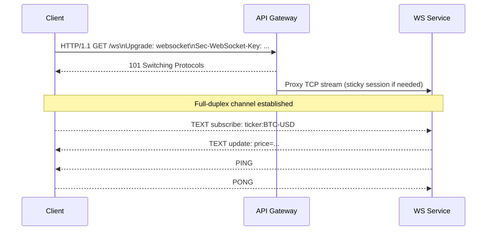

# WebSocket: Architecture and Sequence Flows

WebSocket upgrades an HTTP connection to a long-lived, full-duplex channel. Ideal for real-time updates and interactive apps.

## When to Use
- Low-latency, bidirectional communication (chat, trading, multiplayer).
- Server push to many clients (dashboards, notifications).

Avoid when:
- Simple one-shot requests (use HTTP).
- Fire-and-forget pub/sub (use MQTT/AMQP/Kafka).

## Layering
- App: WebSocket frames (text/binary), subprotocols
- Transport: TCP
- Security: TLS (wss://)
- Network: IPv4/IPv6

## Sequence: Upgrade + Messaging

## Architecture Notes
- Terminate at gateway/ingress; ensure WS upgrade support across proxies/CDNs.
- Scale with horizontal workers; consider topic hubs and fanout services.
- Use sticky sessions when server stateful; prefer external state (Redis) for scale.

## Reliability Patterns
- Heartbeats (PING/PONG) and idle timeouts.
- Reconnect with exponential backoff and jitter.
- Resumable subscriptions using cursors/sequence IDs.
- Backpressure: limit outbound queues, drop policies for stale clients.

## Security
- wss:// only; origin checks; auth via short-lived tokens on connect.
- Authorization per channel/topic; rate limiting per client.
- Input validation for frames; size limits and message quotas.

## Testing and Tools
- websocat, wscat, Postman WS.
- Mitmproxy and Wireshark for inspection.
- Chaos tests for disconnects and failover.