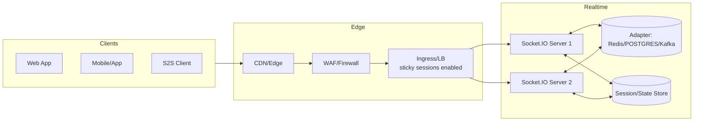
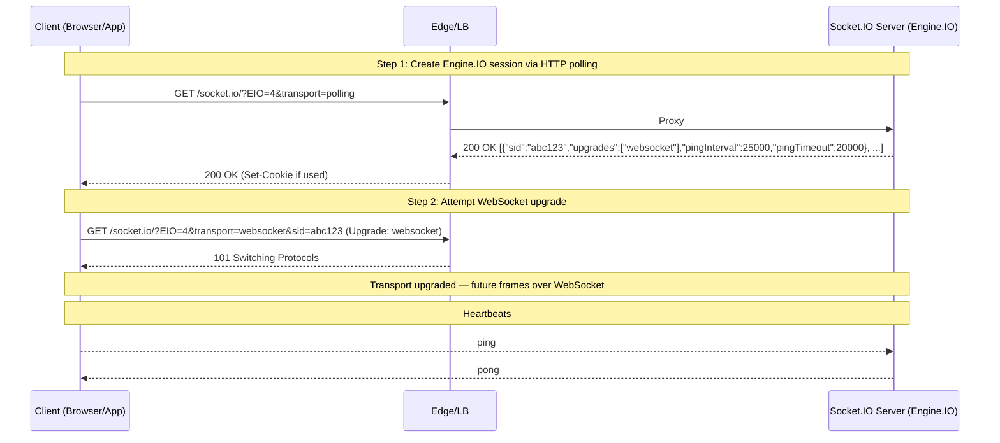
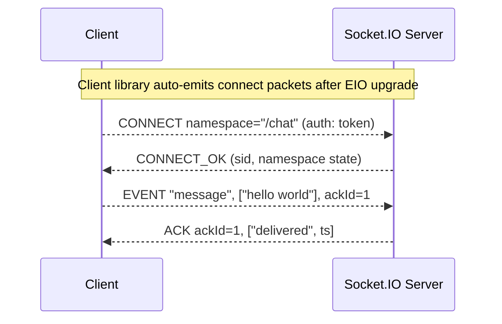
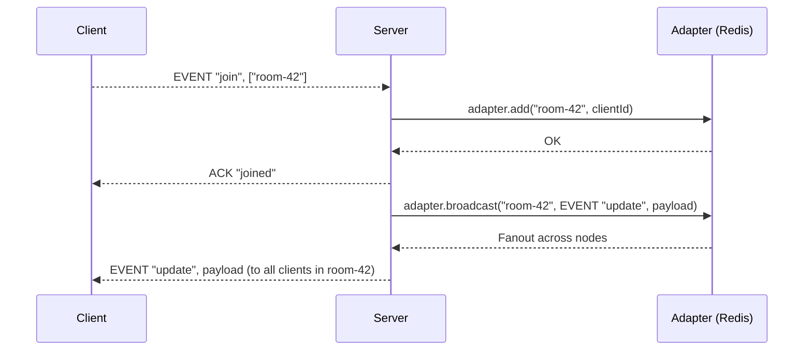
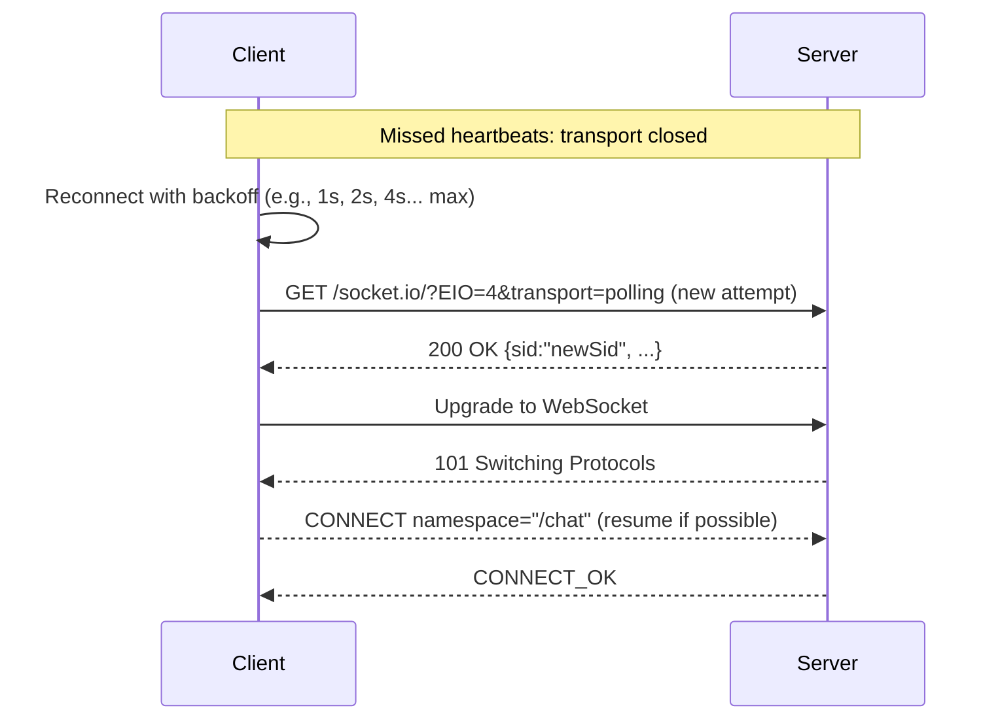

# Socket.IO: Architecture and Sequence Flows

Socket.IO is a real-time application framework that provides an event-based API on top of Engine.IO transports (WebSocket with HTTP long‑polling fallback). It adds reconnection, multiplexing via namespaces, rooms for fanout, acknowledgements, and message buffering out of the box.

## When to Use
- Real-time UX: chat, presence, notifications, dashboards, collaborative apps, multiplayer.
- You want WebSocket semantics with robust fallbacks, reconnection, and a higher-level API.
- You need server-side fanout (rooms) and per-channel authorization.

Avoid when:
- Pure server-to-server or low-overhead binary streaming (use raw WebSocket/gRPC).
- Extremely high fan-out streaming at CDN scale (consider SSE or dedicated streaming infra).

## Layering
- Application: Socket.IO (events, namespaces, rooms, acks)
- Transport/session: Engine.IO (WebSocket preferred, HTTP long‑polling fallback; heartbeats; upgrade)
- Security: TLS (wss/https), JWT/cookies, optional mTLS in private networks
- Network: IPv4/IPv6; proxies/load balancers (sticky sessions recommended without session affinity plugin)

## Reference Architecture



Notes:
- Multi-instance deployments require a pub/sub adapter (e.g., @socket.io/redis-adapter) to propagate room events across nodes.
- Sticky sessions are recommended so Engine.IO upgrades and Socket.IO connection state remain bound to the same node. Some adapters can mitigate strict stickiness needs but affinity still reduces churn.

## Protocol Overview

- Engine.IO (transport layer):
  - Transports: polling (HTTP) and WebSocket.
  - Handshake: HTTP request returns a `sid`, ping interval; client then upgrades to WebSocket if possible.
  - Heartbeats: ping/pong frames; detects broken connections.
  - Reconnection: exponential backoff and jitter.

- Socket.IO (application layer):
  - Namespaces (e.g., `/`, `/chat`): multiplexed logical channels on one physical connection.
  - Rooms: server-side groupings for targeted broadcasts.
  - Events: custom event names with arguments; supports acknowledgements (callbacks).
  - Middlewares: per-namespace auth/validation.

## Sequences

### 1) Engine.IO Handshake with Upgrade to WebSocket



### 2) Socket.IO Connect to Namespace and Emit with Acknowledgement



### 3) Join/Leave Rooms and Broadcast



### 4) Reconnection Flow (Network Glitch)



## Server Design Guidelines

- Scaling:
  - Use a pub/sub adapter for multi-node broadcasts (e.g., @socket.io/redis-adapter).
  - Enable sticky sessions at the load balancer (cookie or source IP) to keep connections on the same node.
  - Limit per-node memory and subscription state; shard by namespace/tenant if necessary.

- Rooms and Namespaces:
  - Use namespaces for distinct auth/feature boundaries.
  - Use rooms for fanout groups; avoid unbounded numbers per client.
  - Clean up room membership on disconnect and on volatile errors.

- Acknowledgements and Delivery:
  - Use acks for at-least-once semantics for important messages.
  - Consider idempotency keys on server handlers to deduplicate.
  - For high-volume, consider volatile emissions for non-critical updates (drop under backpressure).

- Backpressure and Rate Limiting:
  - Monitor per-socket send buffers; apply max queue size and drop policies for volatile events.
  - Rate limit events per client and per room broadcast.

- Persistence and Replay:
  - Socket.IO doesn’t persist messages; integrate with queues/streams if replay or offline delivery is needed.
  - Maintain cursors/timestamps in app layer when delivering catch-up payloads after reconnection.

## Security

- Transport:
  - Use TLS (wss/https). Set secure cookies and HSTS for public endpoints.
  - Validate Origin and Referer headers to prevent cross-site socket hijacking.

- Authentication:
  - Authenticate on connection (namespace middleware) using JWT or session cookies.
  - Revalidate periodically; support token refresh and disconnect on expiry.

- Authorization:
  - Check permissions for joining rooms and emitting specific events.
  - Implement server-side guards; never trust client-side checks.

- Hardening:
  - Limit max payload size and event rate; sanitize inputs.
  - Disable or scope wildcards; namespaced event allowlists for public apps.

## Performance Tips

- Prefer WebSocket transport; allow upgrade as early as possible.
- Coalesce small updates; batch or throttle high-frequency events.
- Use binary (protobuf/MessagePack) for heavy payloads; enable compression judiciously.
- Tune pingInterval/pingTimeout for your network conditions.
- Optimize adapter: Redis with key hashing; use cluster-native clients and connection pooling.

## Ops and Edge

- Load Balancers/Proxies:
  - Enable WebSocket upgrade passthrough; increase idle timeouts beyond pingInterval + margins.
  - Configure sticky sessions (cookie-based) at CDN/ingress.

- Metrics and Observability:
  - Track connects/disconnects, upgrade success rate, transport type ratios, acks latency, dropped messages.
  - Log join/leave room events and broadcast sizes.

- Blue/Green and Deploys:
  - Drain connections gracefully on rollout; notify clients or allow auto-reconnect.

## Testing and Tools

- Clients: socket.io-client (JS/TS, Swift, Java), test with E2E harnesses.
- Debugging: set DEBUG=socket.io:* on server; browser localStorage.debug='socket.io-client:*'.
- Network: mitmproxy/Wireshark to observe WS frames and EIO pings.
- Load: k6/Artillery with WS scenarios; ts-node scripts to simulate sockets at scale.

## Minimal Examples

Client:
```js
import { io } from "socket.io-client";
const socket = io("https://example.com", {
  path: "/socket.io",
  transports: ["websocket"], // optional: prefer WS
  auth: { token: "jwt-here" }
});
socket.on("connect", () => {
  socket.emit("join", "room-42", (ack) => console.log("joined:", ack));
});
socket.on("update", (data) => console.log("update:", data));
socket.on("disconnect", (reason) => console.log("disconnected:", reason));
```

Server (Node.js):
```js
import { createServer } from "http";
import { Server } from "socket.io";
const httpServer = createServer();
const io = new Server(httpServer, {
  path: "/socket.io",
  cors: { origin: "https://app.example.com", credentials: true },
  pingInterval: 25000,
  pingTimeout: 20000
});

io.of("/chat").use((socket, next) => {
  const token = socket.handshake.auth?.token;
  // verify token...
  next();
});

io.of("/chat").on("connection", (socket) => {
  socket.on("join", (room, cb) => { socket.join(room); cb?.("ok"); });
  socket.on("message", (msg, cb) => { socket.to("room-42").emit("update", msg); cb?.("delivered"); });
});

httpServer.listen(3000);
```

## References
- Socket.IO docs: https://socket.io/docs/v4
- Engine.IO protocol: https://github.com/socketio/engine.io-protocol
- Redis adapter: https://github.com/socketio/socket.io-redis-adapter