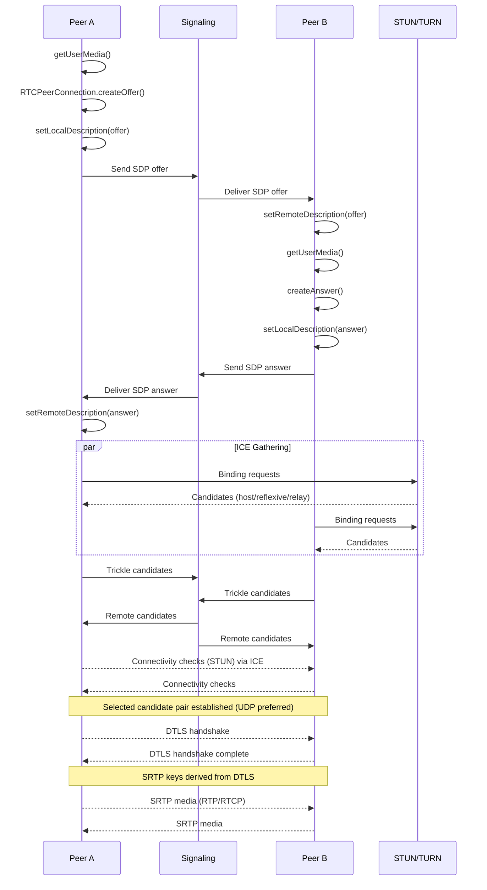
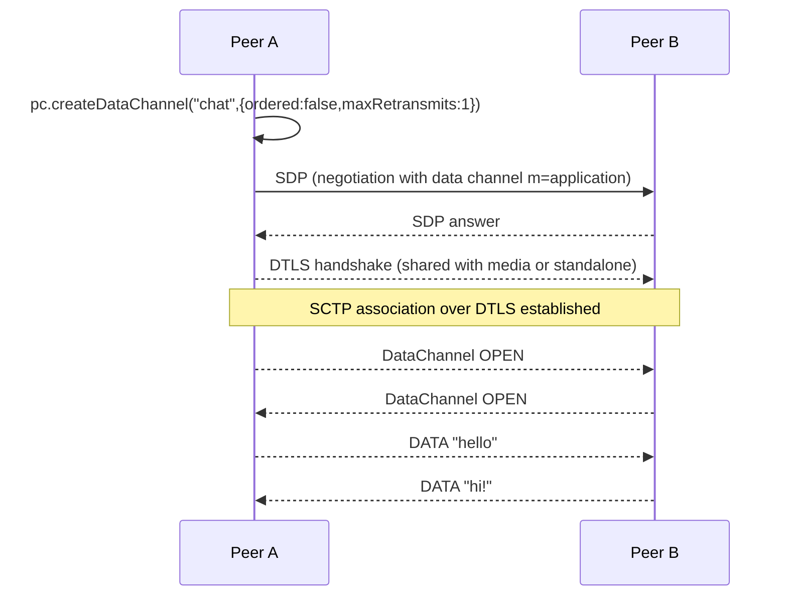

# WebRTC: Architecture and Sequence Flows

WebRTC enables real-time audio/video and data channels between peers with NAT traversal. It uses ICE for connectivity, DTLS-SRTP for media security, and SCTP for data channels. A separate signaling channel is required (e.g., WebSocket/HTTP).

## When to Use
- Interactive A/V calls, conferencing, live broadcasting with low latency.
- Real-time data (chat, presence, game state) via DataChannel.

Avoid when:
- Non-interactive streaming (HLS/DASH) or high fan-out without SFU.
- Deterministic delivery requirements (use WebSocket/QUIC).

## Layering
- Application: Media tracks (getUserMedia), DataChannel API
- Security/Transport: DTLS 1.2/1.3; SRTP for media; SCTP over DTLS for DataChannel
- Connectivity: ICE (STUN for discovery, TURN for relay), UDP preferred (TCP/TLS fallback)
- Network: IPv4/IPv6; NAT traversal; congestion control (GCC/BBR variants)

## Reference Architecture

```mermaid
flowchart LR
  subgraph Clients
    A[Peer A (Browser/App)]
    B[Peer B (Browser/App)]
  end

  subgraph Infra
    Sig[Signaling Server<br/>(WebSocket/HTTP)]
    STUN[STUN Server]
    TURN[TURN Relay]
    SFU[SFU (Selective Forwarding Unit)]
  end

  A<-->Sig
  B<-->Sig
  A<-. ICE .->STUN
  B<-. ICE .->STUN
  A<-. optional relay .->TURN
  B<-. optional relay .->TURN
  A<-->SFU
  B<-->SFU
```

Notes:
- Signaling is app-defined (exchange SDP offers/answers and ICE candidates).
- STUN discovers public reflexive addresses; TURN relays when direct paths fail.
- SFU relays selectively for multi-party; MCU mixes streams (higher CPU, lower client work).

## Sequence: P2P Call Setup (Offer/Answer, ICE, DTLS-SRTP)



## Sequence: DataChannel (SCTP over DTLS)



## Sequence: SFU Conferencing (Publish/Subscribe)

```mermaid
sequenceDiagram
  participant A as Peer A
  participant SFU as SFU
  participant B as Peer B

  A->>SFU: Offer (sendonly)
  SFU-->>A: Answer (recvonly)
  B->>SFU: Offer (sendrecv)
  SFU-->>B: Answer (sendrecv)

  Note over A,SFU,B: ICE/DTLS on each peer<->SFU connection

  A-->>SFU: SRTP uplink (simulcast/SVC)
  SFU-->>B: SRTP downlink (selected layer)
  B-->>SFU: SRTP uplink
  SFU-->>A: SRTP downlink
```

## Reliability and QoS
- Congestion control (GCC/TWCC) adapts bitrate; use TWCC feedback for accuracy.
- Retransmissions (NACK) and Forward Error Correction (FEC) mitigate loss.
- Jitter buffers smooth playback; tune playout delay for stability vs latency.
- ICE restarts on network changes; enforce timeouts and reconnection logic.

## Security
- DTLS-SRTP end-to-end between peers and SFU; optional E2EE via Insertable Streams.
- Identity: token-based auth to signaling and TURN (TURN REST).
- Permissions per room/track; screen share constraints.

## Performance Tips
- Prefer UDP; ensure TURN over UDP is available; fall back to TLS/TCP as last resort.
- Use simulcast/SVC and adaptive layering at SFU for heterogeneous clients.
- Choose codecs wisely: VP8 (compat), H.264 (hardware), VP9/AV1 (quality/bandwidth).
- Limit resolution/frame rate; prioritize audio tracks for QoE.
- Bundle and ICE trickle to reduce setup latency.

## Testing and Tools
- chrome://webrtc-internals, about:webrtc (Firefox).
- Test pages: webrtc.github.io/samples; WebRTC-SDK diagnostics.
- TURN validation: trickle ICE; Wireshark with STUN/DTLS/SRTP dissectors.
- SFU stacks: Janus, mediasoup, Jitsi, Pion.

## References
- WebRTC (w3c/rtcweb); IETF RFCs (ICE, STUN, TURN, DTLS-SRTP)
- webrtc.org; W3C WebRTC API
- Insertable Streams for E2EE