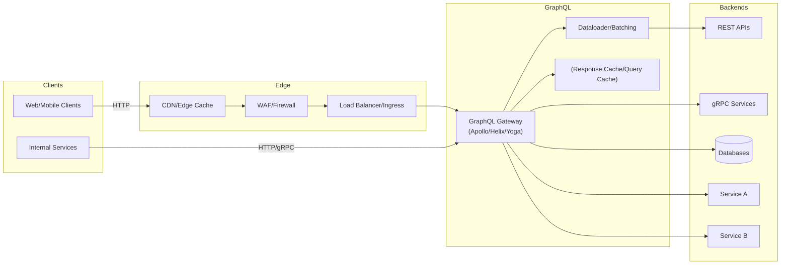
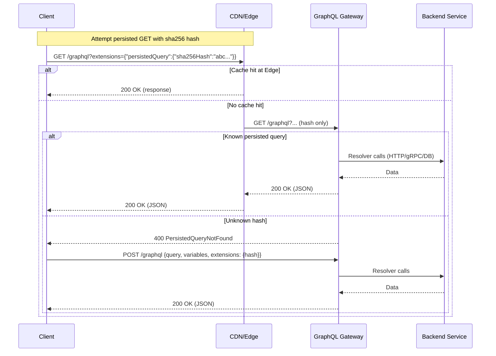
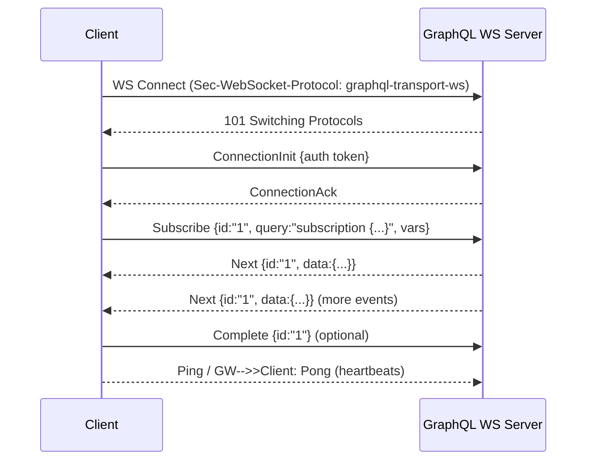
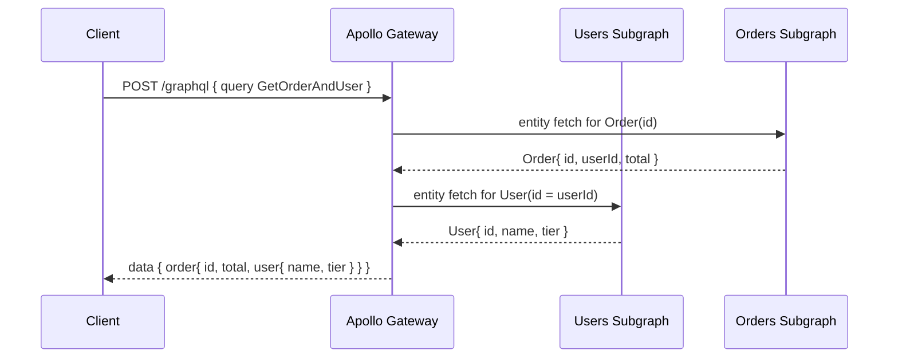

# GraphQL: Architecture and Sequence Flows

GraphQL is a query language and runtime that lets clients request exactly the data they need across multiple backends via a single endpoint. It is transport-agnostic but commonly uses HTTP(S) for queries/mutations and WebSocket or SSE for subscriptions.

## When to Use
- Aggregate data from multiple services into one schema (BFF/API Gateway).
- Product teams need flexible queries without backend changes.
- Strong typing, introspection, and schema-driven tooling/codegen.

Avoid when:
- Simple CRUD APIs with stable shapes (REST may be simpler).
- Heavy unbounded queries without governance (risk of DoS/N+1).

## Layering
- Application: GraphQL schema (SDL), resolvers, directives, persisted queries, federation
- Transport: HTTP/1.1 or HTTP/2 for queries/mutations; WebSocket (graphql-transport-ws) or SSE for subscriptions
- Security: TLS 1.2+ (prefer 1.3); auth via headers/cookies; field-level auth
- Network: IPv4/IPv6, CDN/edge caches for persisted GETs

## Reference Architecture

Notes:
- Gateway composes subgraphs (federation) or delegates to stitched schemas.
- Dataloader batches per-request to prevent N+1 queries.
- Persisted queries enable CDN caching and smaller payloads.

## Sequence: HTTP POST Query (with Persisted Query Fallback)

## Sequence: Subscriptions over WebSocket (graphql-transport-ws)

Alternatives:
- Server-Sent Events (SSE) for simpler, uni-directional subscriptions.
- Legacy `subscriptions-transport-ws` is deprecated.

## Federation Sequence (Gateway → Subgraphs)

## Reliability and Governance
- Enforce query depth/complexity limits; cost analysis; timeouts and max results.
- Persisted queries and allowlists for public clients.
- Idempotent caching of GET persisted queries at CDN.
- Use retries with idempotent backend fetches; deduplicate via Dataloader.

## Security
- TLS 1.3; HSTS; CSRF protection for cookie-based auth (POST with SameSite).
- Field/type-level authorization; schema directives for RBAC/ABAC.
- Disable public introspection in production or protect via auth.
- Rate limiting and throttling per operation/client.

## Performance Tips
- Batch and cache per-request with Dataloader.
- Avoid over-fetching by using fragments and precise fields.
- Use APQ (Automatic Persisted Queries) with GET for cacheability.
- Defer/stream directives for incremental delivery where supported.

## Testing and Tools
- GraphiQL/Playground; Apollo Studio; graphql-inspector (schema diff).
- Codegen: GraphQL Code Generator; client SDKs.
- Tracing: Apollo traces, OpenTelemetry resolvers.

## References
- GraphQL Spec (graphql.org)
- Apollo Federation and Gateway
- graphql-ws (graphql-transport-ws)
- Automatic Persisted Queries (APQ)