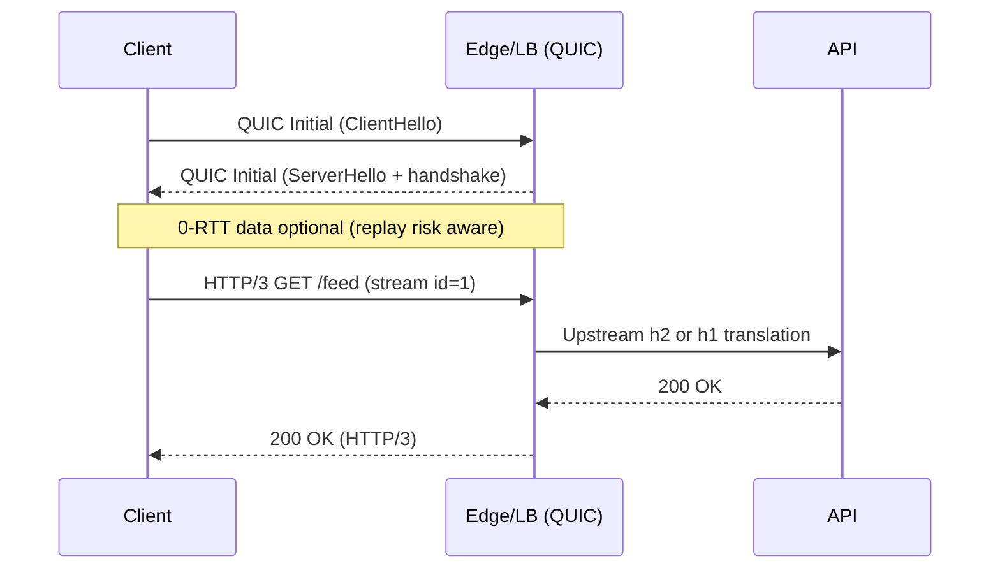

# HTTP/3 (QUIC): Architecture and Sequence Flows

HTTP/3 runs over QUIC (UDP). It reduces head-of-line blocking, improves mobility, and offers faster handshakes and connection migration.

## When to Use
- Mobile or lossy networks; high RTT environments.
- Latency-sensitive APIs where HTTP/2 stalls under loss.
- Clients with modern stack support (browsers, CDNs).

Avoid when:
- Strict UDP egress is blocked or middleboxes interfere.
- Your edge does not yet support QUIC.

## Layering
- App: HTTP/3 semantics (same as HTTP/2 at app layer)
- Transport: QUIC over UDP (streams, flow control, loss recovery)
- Security: TLS 1.3 integrated into QUIC
- Network: IPv4/IPv6, NAT traversal friendly

## Sequence: QUIC + HTTP/3

## Architecture Notes
- Typically terminate QUIC at CDN/edge/gateway; upstream may use h2/h1.
- Connection migration supports IP changes without reconnecting.
- Use 0-RTT sparingly for idempotent GET/HEAD; never for mutating actions.

## Performance Tips
- Expect fewer stalls vs. h2 under packet loss.
- Tune server initial congestion window and max UDP payload sizes.
- Observe handshake failure rates and path MTU blackholes.

## Security
- TLS 1.3 is mandatory within QUIC.
- 0-RTT replay protections: only safe for idempotent requests; validate anti-replay.
- DDoS considerations: amplify protections and rate limits at edge.

## Testing and Tools
- curl --http3, nghttp3/ngtcp2, h3load.
- Wireshark with QUIC keys (SSLKEYLOGFILE) for decryption.
- CDN/vendor dashboards for QUIC metrics.