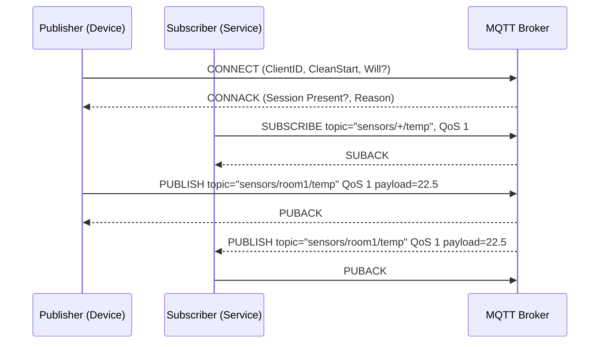

# MQTT: Architecture and Sequence Flows

MQTT is a lightweight pub/sub protocol optimized for constrained devices and unreliable networks. QoS levels allow tuning reliability and cost.

## When to Use
- IoT devices with intermittent connectivity.
- Low bandwidth and power environments.
- Decoupled producer/consumer with topic-based routing.

Avoid when:
- You need complex routing/transactions (prefer AMQP).
- You require large payloads or exactly-once at scale (costly).

## Layering
- App: MQTT 3.1.1 or 5.0; topics; retained messages; LWT
- Transport: TCP
- Security: TLS (and mTLS for device identity)
- Network: IPv4/IPv6; cellular/LPWAN

## Sequence: QoS 1 Publish and Subscribe

QoS 2 uses PUBREC/PUBREL/PUBCOMP for exactly-once delivery.

## Architecture Notes
- Retained messages seed new subscribers with last value.
- Persistent sessions store subscriptions/offline messages.
- Topic design: use stable prefixes, per-device namespaces, and ACL-aligned paths.

## Reliability and QoS
- QoS 0: at-most-once (fastest).
- QoS 1: at-least-once (idempotent consumers required).
- QoS 2: exactly-once (heaviest; use sparingly).
- Use Will messages for device death detection.

## Performance Tips
- Keep payloads small; batch readings.
- Tune keepalive and inflight window.
- Use shared subscriptions for scaling consumers.

## Security
- TLS everywhere; mTLS per device for strong identity.
- Per-topic ACLs; tenant isolation via namespaces/vhosts.
- Validate client IDs; throttle connection storms.

## Testing and Tools
- mosquitto_pub/sub, MQTTX, HiveMQ tools.
- Broker consoles and metrics for session/qos visibility.