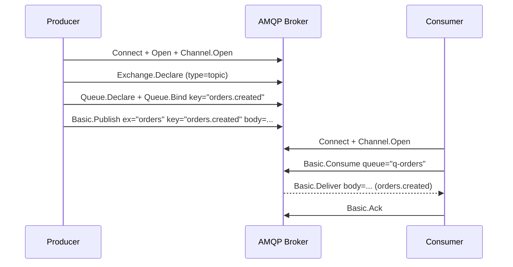

# AMQP (RabbitMQ-style): Architecture and Sequence Flows

AMQP provides brokered messaging with rich routing via exchanges and queues. Common in enterprise workflows and background processing.

## When to Use
- Complex routing (topic, direct, fanout, headers).
- Work queues, task distribution, transactional workflows.
- Dead-lettering and retry topologies.

Avoid when:
- Constrained device clients (prefer MQTT).
- Massive event streaming (prefer Kafka).

## Layering
- App: AMQP 0-9-1 (RabbitMQ) or 1.0; exchanges, queues, bindings
- Transport: TCP
- Security: TLS, SASL auth
- Network: IPv4/IPv6

## Sequence: Produce and Consume with Acknowledgement

## Architecture Notes
- Topologies: DLQ + retry (delayed exchange), per-tenant vhosts.
- Publisher confirms ensure broker persistence before ack.
- Prefetch controls backpressure and fairness.

## Reliability Patterns
- Enable publisher confirms; retry publishes with idempotency keys.
- Consumer retries via DLX with exponential backoff.
- Exactly-once is impractical; design idempotent consumers.

## Performance Tips
- Use multiple channels over one connection; avoid per-message declares.
- Tune prefetch; shard queues for parallelism.
- Persist only when necessary; use quorum queues when needed.

## Security
- TLS, strong credentials; per-vhost/user permissions.
- Network isolation (VPC, private links).
- Payload validation and size caps.

## Testing and Tools
- RabbitMQ management UI, rabbitmqadmin, amqpcat.
- Perf: perf-test, k6 with AMQP libs.
- Monitor: queue depth, consumer lag, confirms.