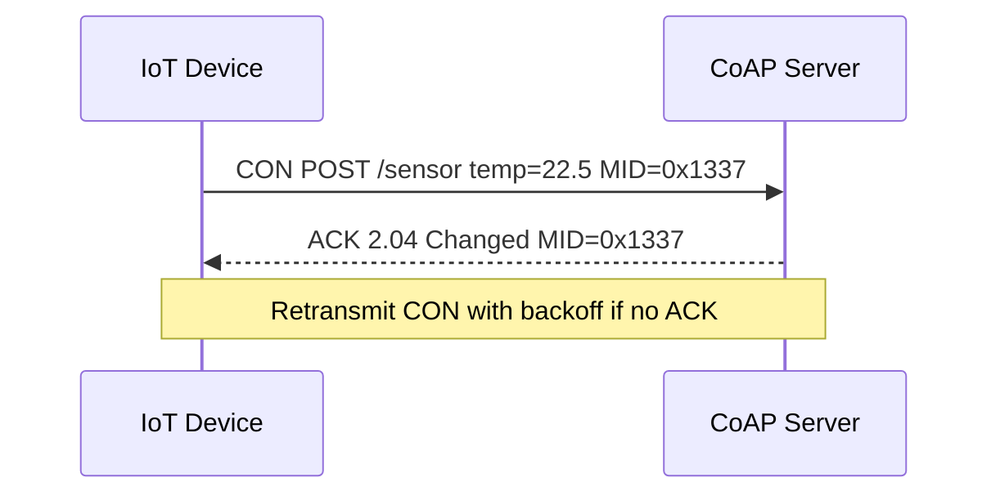

# CoAP (Constrained Application Protocol): Architecture and Sequence Flows

CoAP is a REST-like protocol over UDP tailored for constrained devices and low-power networks. It supports confirmable messages and observation.

## When to Use
- Constrained IoT (low power, lossy links).
- Simple REST semantics with small binary payloads (CBOR).

Avoid when:
- You need large payloads and strong ordering (consider MQTT or HTTP).
- UDP is filtered or middleboxes are hostile.

## Layering
- App: CoAP (methods: GET/POST/PUT/DELETE), Observe, Block-wise, CBOR
- Transport: UDP
- Security: DTLS 1.2/1.3, OSCORE (object security)
- Network: IPv4/IPv6/6LoWPAN

## Sequence: Confirmable POST

## Architecture Notes
- Use proxies to bridge CoAP↔HTTP when integrating with web services.
- Observe enables server push; manage state and max observers.
- Block-wise transfers split large payloads across datagrams.

## Reliability Patterns
- Confirmable (CON) for reliability; Non-confirmable (NON) for fire-and-forget.
- Exponential backoff for retransmissions; dedup via Message IDs and tokens.
- Use ETags and caching where applicable.

## Performance Tips
- Compact payloads via CBOR; keep URIs short.
- Optimize retransmission parameters for link characteristics.
- Batch readings or use Observe to reduce polling.

## Security
- DTLS with PSK or certificates; consider OSCORE for end-to-end object security.
- Limit exposure via gateways; strict resource ACLs.
- Replay protection and anti-amplification on gateways.

## Testing and Tools
- libcoap (coap-client/coap-server), aiocoap CLI.
- Analyzers: Wireshark with CoAP dissector.