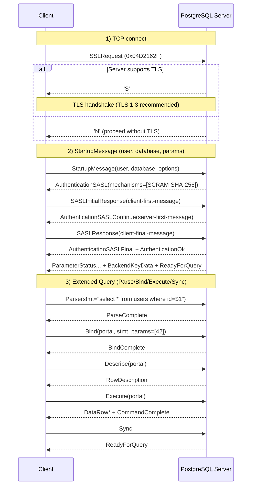
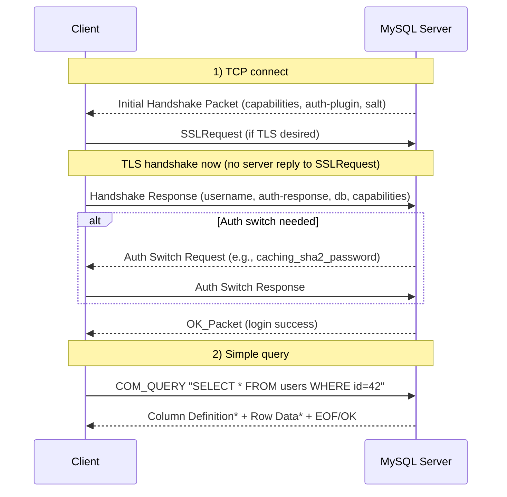
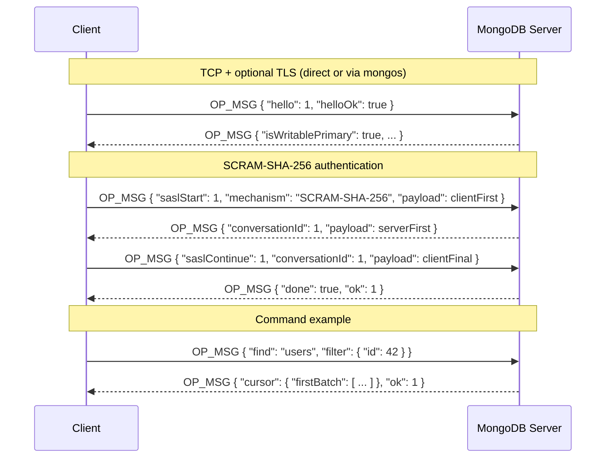
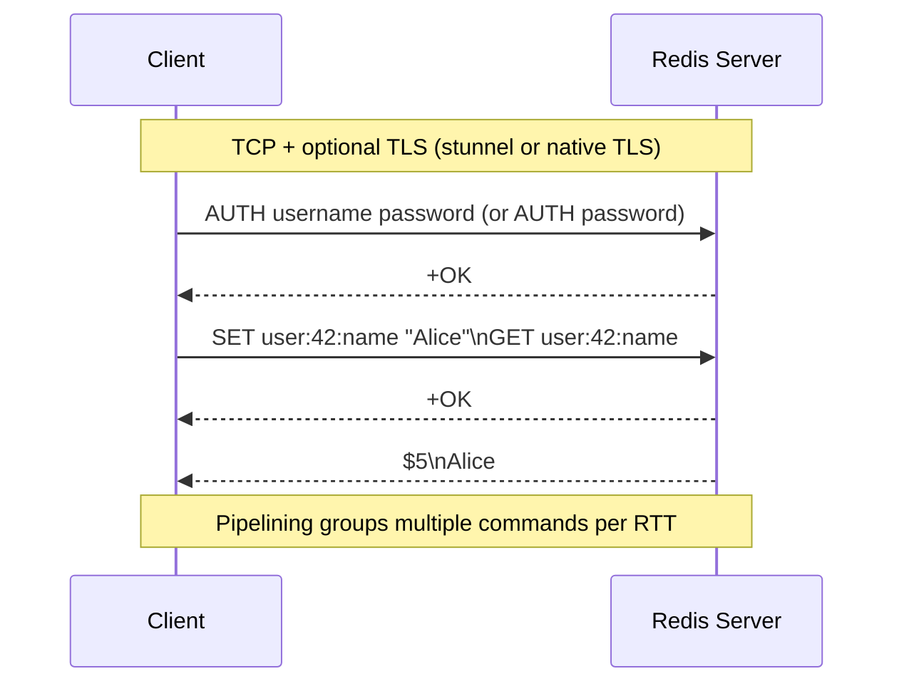
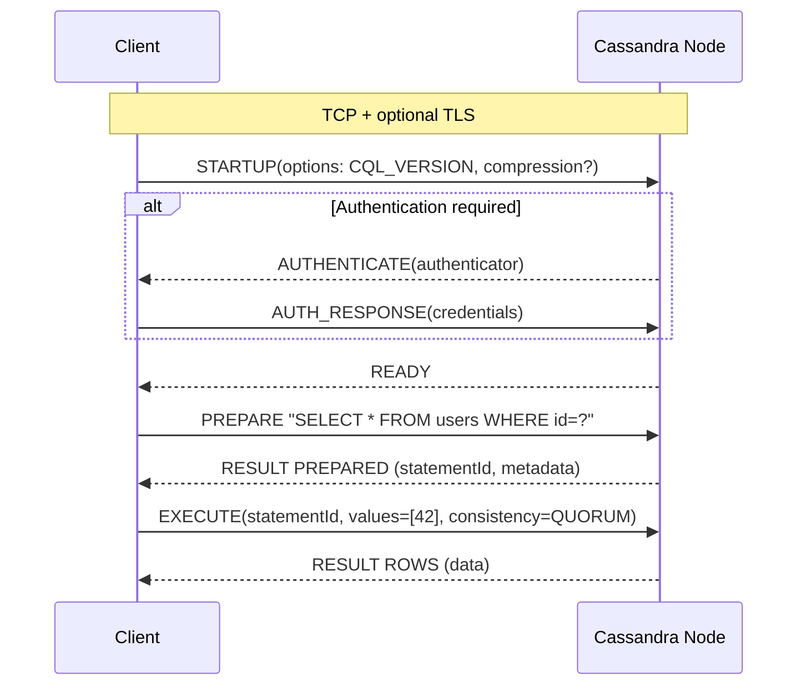

# Database Protocols: Architecture and Sequence Flows

This guide describes common database wire protocols, their architecture patterns, handshake/authentication flows, and typical query/transaction sequences. It focuses on:
- PostgreSQL (PostgreSQL Frontend/Backend protocol)
- MySQL (MySQL client/server protocol)
- MongoDB (MongoDB Wire Protocol, OP_MSG)
- Redis (RESP/RESP3)
- Cassandra (Native Protocol + CQL)

Use this to reason about connection management, security, performance, and reliability from the application to the database cluster.

## Table of Contents
- Overview
- Reference Architecture
- Connection Lifecycle and Pooling
- Protocol Deep Dives
  - PostgreSQL
  - MySQL
  - MongoDB
  - Redis
  - Cassandra
- Reliability and Transactions
- Security
- Performance Tips
- Testing and Tools
- References

---

## Overview

Most databases speak a custom binary protocol over TCP with optional TLS:
- Session-oriented: Connection handshake, authentication, then a multiplex of requests/responses (some support pipelining).
- Query model: Text (SQL) or binary-encoded commands (CQL, BSON, RESP).
- Features: Prepared statements, server-side cursors/streams, transactions, batching/pipelining.
- Topologies: Single node, primary-replica, sharded, or peer-to-peer (ring).

Ports (defaults):
- PostgreSQL: 5432
- MySQL/MariaDB: 3306
- MongoDB: 27017
- Redis: 6379 (TLS often on 6380)
- Cassandra: 9042

---

## Reference Architecture

```mermaid
flowchart LR
  subgraph AppTier[Application Tier]
    A[App Service]
    Pool[Connection Pool<br/>(Hikari/pgBouncer/ProxySQL)]
  end

  subgraph Edge[Optional Proxies/Gateways]
    PgB[pgBouncer]
    Pxy[ProxySQL / HAProxy]
    Mongos[mongos Router]
    RedisP[Redis Sentinel/Proxy]
  end

  subgraph DB[Database Cluster]
    subgraph PG[PostgreSQL Primary/Replicas]
      PG1[(Primary)]
      PG2[(Replica)]
    end
    subgraph MY[MySQL Primary/Replicas]
      MY1[(Primary)]
      MY2[(Replica)]
    end
    subgraph MG[MongoDB Replica Set / Shards]
      M1[(Primary)]
      M2[(Secondary)]
    end
    subgraph RD[Redis Cluster]
      R1[(Shard A)]
      R2[(Shard B)]
    end
    subgraph CS[Cassandra Ring]
      C1[(Node 1)]
      C2[(Node 2)]
      C3[(Node 3)]
    end
  end

  A-->Pool
  Pool-->PgB
  Pool-->Pxy
  Pool-->Mongos
  Pool-->RedisP

  PgB-->PG1
  PgB-->PG2
  Pxy-->MY1
  Pxy-->MY2
  Mongos-->M1
  Mongos-->M2
  RedisP-->R1
  RedisP-->R2
  A-->C1
  A-->C2
  A-->C3
```

Notes:
- Connection pools reduce handshake/auth overhead and stabilize resource usage.
- Read/write splitting via proxies (ProxySQL, pgBouncer, mongos, Redis cluster routing).
- Cassandra drivers perform topology discovery and token-aware routing without a central proxy.

---

## Connection Lifecycle and Pooling

Typical lifecycle:
1) TCP connect
2) Optional TLS negotiation/handshake
3) Authentication (password/SCRAM/SASL/mTLS)
4) Session setup (parameters, default DB/schema, timeouts)
5) Queries/commands (optionally prepared and/or pipelined)
6) Transaction boundaries (BEGIN/COMMIT/ROLLBACK)
7) Keepalive/heartbeat; idle timeouts
8) Connection close or reuse via pool

Pooling strategies:
- App-side pools (HikariCP for JDBC, node-postgres pool, etc.)
- External pools/proxies (pgBouncer session/transaction pooling; ProxySQL for MySQL)
- Per-DB pools (mongos, Redis cluster client-side pooling; Cassandra channel pools per host)

---

## PostgreSQL Protocol (Frontend/Backend)

PostgreSQL speaks a custom binary protocol over TCP, with an optional SSL negotiation and robust extended query flow.

### Sequence: TLS + SCRAM + Extended Query



Key points:
- Two query paths: Simple Query (Query message) vs Extended (Parse/Bind/Execute).
- Authentication: Prefer SCRAM-SHA-256; MD5 is legacy; Kerberos/GSSAPI also supported.
- Server pushes ParameterStatus updates; ReadyForQuery marks transaction status.
- Cursors and COPY use streaming for large datasets.

---

## MySQL Protocol (Client/Server)

MySQL uses a binary protocol with an initial capability negotiation and pluggable auth (e.g., caching_sha2_password by default in MySQL 8).

### Sequence: TLS + Handshake + COM_QUERY



Key points:
- Auth plugins: caching_sha2_password (default), mysql_native_password (legacy), SHA256, etc.
- Prepared statements via COM_STMT_PREPARE/EXECUTE for efficiency.
- Result sets streamed; multi-statements optional; transactions controlled via SQL or autocommit.

---

## MongoDB Wire Protocol (OP_MSG)

MongoDB uses BSON-encoded commands over TCP. Modern drivers use OP_MSG framing with commands like hello, find, aggregate.

### Sequence: TLS + SCRAM + Command



Key points:
- Topologies: standalone, replica sets, or sharded via mongos; drivers discover topology.
- Commands are BSON; cursors stream batches; retryable writes and read concerns control consistency.

---

## Redis Protocol (RESP/RESP3)

Redis uses a simple text/binary protocol (RESP). Commands are request/response; pipelining is common; Pub/Sub supported.

### Sequence: TLS + AUTH + Pipelined GET/SET



Key points:
- RESP3 adds richer types; cluster mode uses MOVED/ASK redirections; clients route by key hash slots.
- Persistence via RDB/AOF; Lua scripting; Streams; Pub/Sub.

---

## Cassandra Native Protocol (CQL)

Cassandra’s native protocol (v4/v5) uses frames over TCP. The driver manages a pool per host, topology discovery, and token-aware routing.

### Sequence: STARTUP + PREPARE/EXECUTE



Key points:
- Consistency levels (ONE, QUORUM, ALL) balance latency vs durability.
- Coordinator node routes to replicas; paging for large results; idempotent statements for retries.

---

## Reliability and Transactions

- PostgreSQL/MySQL:
  - ACID transactions; use BEGIN/COMMIT/ROLLBACK.
  - Server-side prepared statements reduce parse overhead.
  - Use idempotency where retries may happen (app/middle tiers).
- MongoDB:
  - Multi-document transactions on replica sets/sharded clusters; otherwise per-document atomicity.
  - Retryable writes; write concerns (w, j) and read concerns (local, majority).
- Redis:
  - MULTI/EXEC for transactional batches; Lua scripts for atomic ops.
  - For at-least-once semantics, combine with streams and consumer groups.
- Cassandra:
  - No cross-partition transactions; lightweight transactions (LWT) for CAS on a single partition.
  - Handle timeouts and retries with awareness of consistency levels.

---

## Security

- Transport:
  - TLS 1.3 preferred; enforce modern ciphers; consider mTLS for internal zero-trust.
- Authentication:
  - PostgreSQL: SCRAM-SHA-256; avoid md5/cleartext; GSS/Kerberos where needed.
  - MySQL: caching_sha2_password; avoid mysql_native_password; use RSA exchange if not TLS (prefer TLS).
  - MongoDB: SCRAM-SHA-256; x.509 (mTLS) possible; enable authorization.
  - Redis: Always require ACLs; use username/password; prefer TLS; network isolation.
  - Cassandra: PasswordAuthenticator or Kerberos; role-based access control.
- Authorization:
  - Principle of least privilege (schemas, tables, roles, keyspaces, commands).
- Exposure:
  - Private networks/VPCs, security groups; no public exposure unless absolutely necessary.

---

## Performance Tips

- Pooling:
  - Right-size pool to DB capacity; avoid connection storms; prefer transaction pooling (pgBouncer) for bursty loads.
- Batching/pipelining:
  - Redis pipelining; batch INSERTs or use COPY (PostgreSQL); bulk operations in MongoDB; prepared statements for MySQL/Cassandra.
- Indexing and plans:
  - Observe slow query logs; analyze plans (EXPLAIN/ANALYZE); keep stats fresh.
- Network:
  - Keep TLS session resumption; enable TCP keepalives; avoid Nagle where latency-sensitive.
- Data transfer:
  - Stream results; page where supported; avoid fetching unneeded columns.
- Topology-aware:
  - Read from replicas (read-only) when acceptable; token-aware routing in Cassandra; read preferences in MongoDB.

---

## Testing and Tools

- PostgreSQL: psql, pgAdmin, EXPLAIN/ANALYZE, pg_stat_statements, Wireshark (PostgreSQL dissector).
- MySQL: mysql client, MySQL Shell, EXPLAIN, Performance Schema, Wireshark.
- MongoDB: mongosh, Compass, explain(), Profiler, Wireshark (BSON/OP_MSG).
- Redis: redis-cli, MONITOR, latency doctor, RDB/AOF tools, Wireshark (RESP).
- Cassandra: cqlsh, nodetool, Tracing, Wireshark (Cassandra protocol).
- Proxies: pgBouncer, ProxySQL, HAProxy; observe connection churn, queueing, and query latency.

---

## References

- PostgreSQL Protocol: docs (Frontend/Backend), SCRAM-SHA-256
- MySQL Client/Server Protocol: dev.mysql.com
- MongoDB Wire Protocol (OP_MSG), SCRAM: mongodb.com/docs
- Redis Protocol (RESP/RESP3): redis.io/docs/reference/protocol-spec/
- Cassandra Native Protocol v4/v5: Apache Cassandra docs